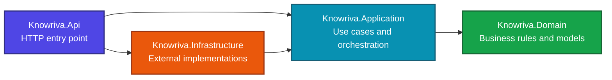

<div align="center">
  <h1>Knowriva</h1>
  <p><strong>Give your learning a direction.</strong></p>
  <p>
    An API-first platform for organizing learning goals, tracking progress,
    and turning consistent effort into visible growth.
  </p>

  <p>
    
    
    
    
  </p>
</div>

## Overview

Knowriva is being built around a simple idea: learning becomes easier to manage when goals, subjects, resources, and progress are connected in one place.

The project currently contains the initial ASP.NET Core solution and its core architectural boundaries. The first application features will be introduced incrementally on top of this foundation.

## Current foundation

- ASP.NET Core API entry point.
- Separate Domain, Application, and Infrastructure projects.
- Explicit project references that preserve the dependency direction.
- Nullable reference types and implicit global usings enabled.
- Repository-level `.gitignore` for build output and local files.

## Architecture



| Project | Responsibility |
| --- | --- |
| `Knowriva.Api` | Hosts the HTTP API and acts as the application composition root. |
| `Knowriva.Application` | Coordinates use cases and defines application-facing abstractions. |
| `Knowriva.Domain` | Contains business concepts and rules independent of infrastructure. |
| `Knowriva.Infrastructure` | Provides implementations for persistence and other external concerns. |

## Planned capabilities

The platform is intended to grow through focused increments, including:

- Learning goals and skill areas.
- Topics, resources, and personal notes.
- Progress entries and completion history.
- Review reminders and learning streaks.
- Authentication and personal workspaces.
- Progress summaries and useful analytics.

## Getting started

### Requirements

- [.NET 10 SDK](https://dotnet.microsoft.com/download/dotnet/10.0)

### Run the API

```bash
dotnet build Knowriva.slnx
dotnet run --project src/Knowriva.Api/Knowriva.Api.csproj
```

The running URL is printed in the terminal. At the current foundation stage, the API exposes the starter root endpoint while the first feature is being developed.

## Repository structure

```text
Knowriva/
├── src/
│   ├── Knowriva.Api/
│   ├── Knowriva.Application/
│   ├── Knowriva.Domain/
│   └── Knowriva.Infrastructure/
├── Knowriva.slnx
├── .gitignore
└── README.md
```

Knowriva will evolve as new capabilities, tests, API contracts, and delivery workflows are added.
