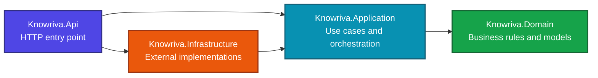

<div align="center">
  <h1>Knowriva</h1>
  <p><strong>Give your learning a direction.</strong></p>
  <p>
    An API-first platform for organizing learning goals, tracking progress,
    and turning consistent effort into visible growth.
  </p>

  <p>
    
    
    
    
  </p>
</div>

## Overview

Knowriva is being built around a simple idea: learning becomes easier to manage when goals, subjects, resources, and progress are connected in one place.

The API currently creates and retrieves learning goals, validates creation requests, and saves goals to a local SQLite database. Features will be added incrementally on top of this foundation.

## Current capabilities

- `POST /api/learning-goals` creates and saves a learning goal.
- `GET /api/learning-goals/{id}` retrieves a saved goal or returns 404 when it does not exist.
- FluentValidation rejects invalid creation requests before the command handler runs.
- EF Core migrations manage the SQLite schema; the local database file is ignored by Git.
- Domain, Application, Infrastructure, Contracts, and API projects have explicit references.

## Architecture



| Project | Responsibility |
| --- | --- |
| `Knowriva.Api` | Hosts the HTTP API and acts as the application composition root. |
| `Knowriva.Application` | Coordinates use cases and defines application-facing abstractions. |
| `Knowriva.Domain` | Contains business concepts and rules independent of infrastructure. |
| `Knowriva.Infrastructure` | Provides implementations for persistence and other external concerns. |

## Planned capabilities

The platform is intended to grow through focused increments, including:

- Updating and managing learning goals and skill areas.
- Topics, resources, and personal notes.
- Progress entries and completion history.
- Review reminders and learning streaks.
- Authentication and personal workspaces.
- Progress summaries and useful analytics.

## Getting started

### Requirements

- [.NET 10 SDK](https://dotnet.microsoft.com/download/dotnet/10.0)
- [EF Core CLI (`dotnet-ef`)](https://learn.microsoft.com/en-us/ef/core/cli/dotnet), version 10.0.11, to apply migrations

### Run the API

```bash
dotnet build Knowriva.slnx
dotnet ef database update --project src/Knowriva.Infrastructure --startup-project src/Knowriva.Api
dotnet run --project src/Knowriva.Api/Knowriva.Api.csproj --launch-profile http
```

The API listens on `http://localhost:5000` with the `http` profile. In VS Code REST Client, send the POST request in `requests/requests.http` first, then the GET request; it uses the ID from the POST response. The database is stored at `src/Knowriva.Api/knowriva.db` and is not committed.

## Repository structure

```text
Knowriva/
├── src/
│   ├── Knowriva.Api/
│   ├── Knowriva.Application/
│   ├── Knowriva.Contracts/
│   ├── Knowriva.Domain/
│   └── Knowriva.Infrastructure/
├── requests/
├── Knowriva.slnx
├── .gitignore
└── README.md
```

Knowriva will evolve as new capabilities, tests, API contracts, and delivery workflows are added.
