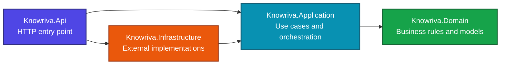

<div align="center">
  <h1>Knowriva</h1>
  <p><strong>Give your learning a direction.</strong></p>
  <p>
    An API-first platform for organizing learning goals, tracking progress,
    and turning consistent effort into visible growth.
  </p>

  <p>
    
    
    
    
  </p>
</div>

## Overview

Knowriva is being built around a simple idea: learning becomes easier to manage when goals, subjects, resources, and progress are connected in one place.

The API currently creates, lists, retrieves, and updates learning goals, validates creation and update requests, and saves goals to a local SQLite database. Features will be added incrementally on top of this foundation.

## Current capabilities

- `POST /api/learning-goals` creates and saves a learning goal, returning `201 Created` and a link to it.
- `GET /api/learning-goals` lists saved goals.
- `GET /api/learning-goals/{id}` retrieves a saved goal or returns 404 when it does not exist.
- `PUT /api/learning-goals/{id}` updates a goal's title, description, and target date, returning `200 OK` with the updated goal or 404 when it does not exist.
- FluentValidation rejects invalid creation and update requests with `400 Bad Request` before the command handler runs. Titles are required and limited to 200 characters; optional descriptions are limited to 1,000 characters.
- EF Core migrations manage the SQLite schema; the local database file is ignored by Git.
- Domain, Application, Infrastructure, Contracts, and API projects have explicit references.

Updates replace all three editable fields. Send `null` for the description or target date to clear that value. The goal's ID and creation time stay unchanged, and its update timestamp is set after a successful edit.

## Architecture


```mermaid
flowchart LR
    API[Knowriva.Api\nHTTP entry point]
    APP[Knowriva.Application\nUse cases and orchestration]
    DOMAIN[Knowriva.Domain\nBusiness rules and models]
    INFRA[Knowriva.Infrastructure\nExternal implementations]

    API --> APP
    API --> INFRA
    APP --> DOMAIN
    INFRA --> APP

    classDef api fill:#4F46E5,color:#fff,stroke:#312E81,stroke-width:2px
    classDef app fill:#0891B2,color:#fff,stroke:#155E75,stroke-width:2px
    classDef domain fill:#16A34A,color:#fff,stroke:#166534,stroke-width:2px
    classDef infra fill:#EA580C,color:#fff,stroke:#9A3412,stroke-width:2px

    class API api
    class APP app
    class DOMAIN domain
    class INFRA infra
```

| Project | Responsibility |
| --- | --- |
| `Knowriva.Api` | Hosts the HTTP API and acts as the application composition root. |
| `Knowriva.Application` | Coordinates use cases and defines application-facing abstractions. |
| `Knowriva.Contracts` | Defines HTTP request contracts. |
| `Knowriva.Domain` | Contains business concepts and rules independent of infrastructure. |
| `Knowriva.Infrastructure` | Provides implementations for persistence and other external concerns. |

## Planned capabilities

The platform is intended to grow through focused increments, including:

- Goal status, completion, and archiving or deletion.
- Topics, resources, and personal notes.
- Progress entries and completion history.
- Review reminders and learning streaks.
- Authentication and personal workspaces.
- Progress summaries and useful analytics.

## Getting started

### Requirements

- [.NET 10 SDK](https://dotnet.microsoft.com/download/dotnet/10.0)
- [EF Core CLI (`dotnet-ef`)](https://learn.microsoft.com/en-us/ef/core/cli/dotnet), version 10.0.11, to apply migrations

### Run the API

```bash
dotnet build Knowriva.slnx
dotnet ef database update --project src/Knowriva.Infrastructure --startup-project src/Knowriva.Api
dotnet run --project src/Knowriva.Api/Knowriva.Api.csproj --launch-profile http
```

The API listens on `http://localhost:5000` with the `http` profile. Use `requests/requests.http` in VS Code REST Client to create, list, retrieve, or update goals. Replace the example IDs in the GET-by-ID and PUT requests with an ID returned by the POST or list response. The database is stored at `src/Knowriva.Api/knowriva.db` and is not committed.

## Tests

Run the API integration tests from the repository root:

```bash
dotnet test Knowriva.slnx
```

The tests exercise goal creation, listing, lookup, updating, and validation through HTTP. Update coverage checks saved changes, unchanged IDs and creation times, rejected updates that leave data unchanged, missing goals, and clearing optional values. Each test uses its own temporary SQLite database and applies the EF Core migrations.

GitHub Actions automatically restores the solution, builds it in Release configuration, and runs the tests for pull requests targeting `main` and pushes to `main`. The workflow is defined in [`.github/workflows/dotnet.yml`](.github/workflows/dotnet.yml).

## Repository structure

```text
Knowriva/
├── .github/workflows/
│   └── dotnet.yml
├── src/
│   ├── Knowriva.Api/
│   ├── Knowriva.Application/
│   ├── Knowriva.Contracts/
│   ├── Knowriva.Domain/
│   └── Knowriva.Infrastructure/
├── tests/
│   └── Knowriva.Api.Tests/
├── requests/
├── Knowriva.slnx
├── .gitignore
└── README.md
```

Knowriva will evolve through further learning-goal and progress-tracking features.
